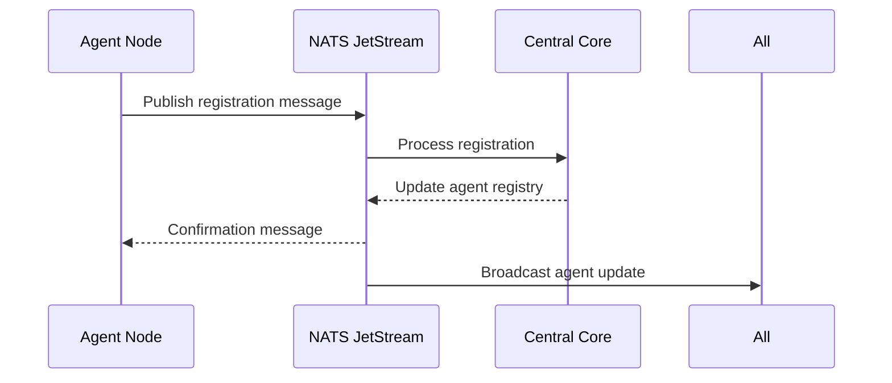
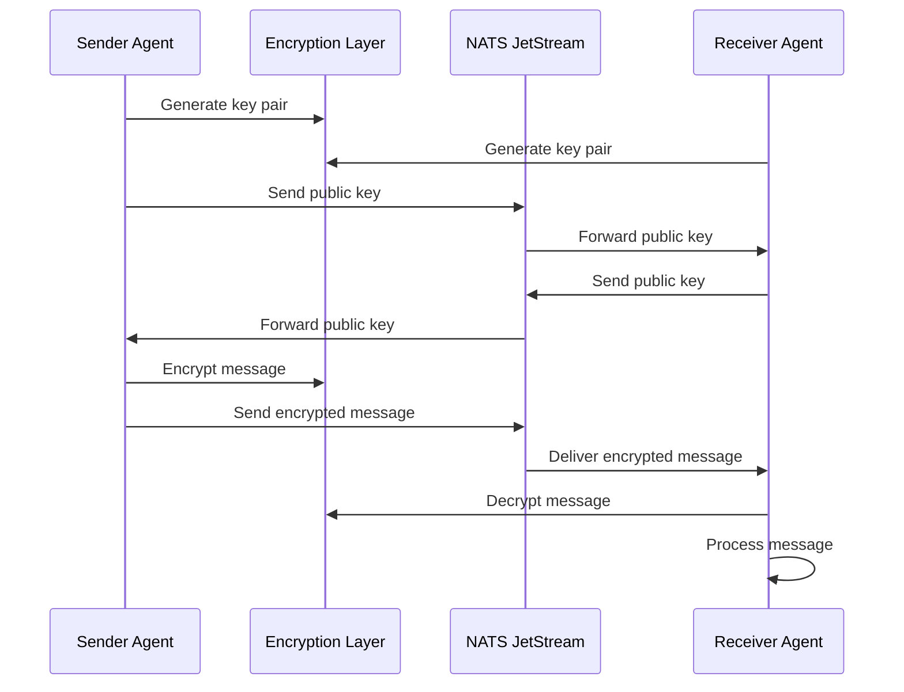
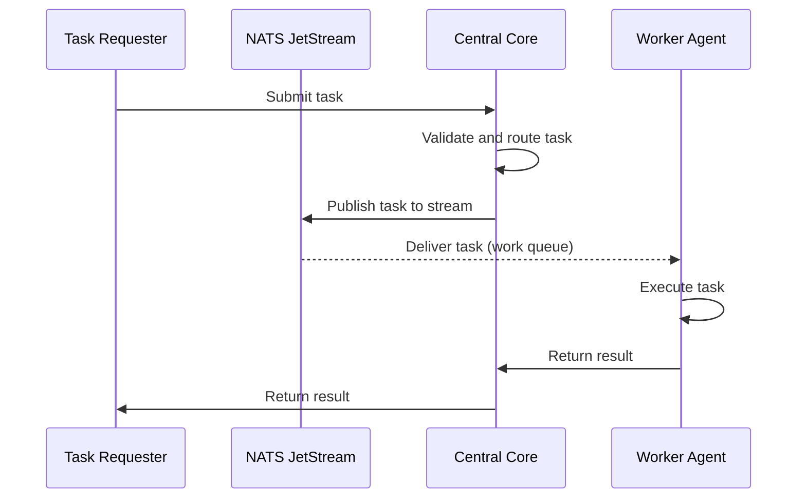

# Decentralized AI Ecosystem - Coordination Layer Architecture

## Overview

The **Coordination Layer** serves as the decentralized nervous system of the AI ecosystem, providing:

- Agent discovery and registration
- Identity verification and authentication
- Secure encrypted messaging
- Task routing and distribution
- Event streaming and broadcasting
- Peer-to-peer communication
- System health monitoring

This layer is designed to be highly fault-tolerant, scalable, and truly decentralized using NATS JetStream and libp2p technologies.

## Architecture Components

### 1. NATS JetStream - Coordination Hub

**File:** [`central_core_system/coordination/nats_jetstream.py`](central_core_system/coordination/nats_jetstream.py)

**Key Features:**
- **Agent Discovery & Registration:** Real-time agent discovery and lifecycle management
- **Message Routing:** Smart message routing with load balancing
- **Event Streaming:** Durable event streaming with guaranteed delivery
- **Task Distribution:** Efficient task distribution using work queue patterns
- **JetStream Streams:** Persistent message storage with configurable retention

**Streams Created:**
- `AGENT_DISCOVERY`: Agent registration and heartbeat messages
- `AGENT_MESSAGES`: Encrypted messages between agents
- `TASK_ROUTING`: Task distribution and execution
- `SYSTEM_EVENTS`: System telemetry and status events

### 2. Encryption Layer - End-to-End Security

**File:** [`agent_node_system/communication/encryption_layer.py`](agent_node_system/communication/encryption_layer.py)

**Security Features:**
- **X25519 Key Exchange:** Secure key exchange for peer-to-peer communication
- **AES-GCM Encryption:** Authenticated encryption for messages
- **Ed25519 Signatures:** Digital signatures for message integrity
- **Key Management:** Automatic key generation and management

**Encryption Flow:**
1. Generate X25519 key pair per agent
2. Exchange public keys via NATS
3. Derive shared secret using X25519
4. Encrypt messages with AES-GCM
5. Sign messages with Ed25519

### 3. Message Handler - Message Processing

**File:** [`agent_node_system/communication/message_handler.py`](agent_node_system/communication/message_handler.py)

**Message Types:**
- `TEXT`: Text messages between agents
- `TASK`: Task assignments and instructions
- `RESPONSE`: Task execution results
- `STATUS`: Agent status updates
- `ERROR`: Error notifications
- `DISCOVERY`: Agent discovery messages
- `HEARTBEAT`: Agent heartbeat messages

**Key Features:**
- Message validation and deserialization
- Type-specific message processing
- Message history and retention
- Heartbeat and status management

### 4. Event Listener - Event Handling

**File:** [`agent_node_system/communication/event_listener.py`](agent_node_system/communication/event_listener.py)

**Event Types:**
- `AGENT_REGISTERED`: Agent joined the network
- `AGENT_UNREGISTERED`: Agent left the network
- `AGENT_STATUS_UPDATED`: Agent status change
- `TASK_CREATED`: New task created
- `TASK_ASSIGNED`: Task assigned to agent
- `TASK_COMPLETED`: Task execution completed
- `TASK_FAILED`: Task execution failed
- `MESSAGE_RECEIVED`: Message received
- `SYSTEM_READY`: System startup completed
- `SYSTEM_SHUTDOWN`: System shutdown initiated
- `ERROR_OCCURRED`: System error
- `RESOURCE_LOW`: Resource warning

**Event Processing:**
- Event filtering by type and source
- Correlation ID tracking
- Event history management
- Global and type-specific handlers

### 5. P2P Client - Direct Communication

**File:** [`agent_node_system/communication/p2p_client.py`](agent_node_system/communication/p2p_client.py)

**Features:**
- Libp2p-based peer-to-peer communication
- Direct agent-to-agent messaging without intermediaries
- Stream multiplexing and management
- Peer discovery and connection management
- Broadcast messages to connected peers

**Connection Architecture:**
- Peer addresses with multiaddr format
- Stream handler system for message processing
- Periodic peer discovery mechanism

## Communication Flow

### Agent Registration Flow



### Secure Messaging Flow



### Task Routing Flow



## Configuration

### NATS JetStream Configuration

**Environment Variables:**
```env
NATS_URL=nats://localhost:4222
NATS_STREAM_RETENTION=limits
NATS_STREAM_MAX_BYTES=1GB
NATS_STREAM_MAX_AGE=7d
```

**Docker Compose:**
```yaml
services:
  nats:
    image: nats:latest
    ports:
      - "4222:4222"
      - "6222:6222"
      - "8222:8222"
    command: --jetstream --store_dir /nats
```

### Agent Configuration

**Environment Variables:**
```env
CENTRAL_CORE_URL=http://localhost:8000
WEBSOCKET_URL=ws://localhost:8000/ws
NATS_URL=nats://localhost:4222
AGENT_ID=agent-001
AGENT_NAME=My Agent
AGENT_ROLE=general-purpose
```

## Scalability and Fault Tolerance

### JetStream Scalability Features

- **Stream Partitioning:** Automatic partitioning by subject patterns
- **Consumer Groups:** Load balancing with durable consumers
- **Message Replicas:** Configurable replication factor
- **Rate Limiting:** Per-consumer message rate limits
- **Slow Consumers:** Automatic management of slow consumers

### High Availability

- Multi-region NATS cluster support
- Automatic failover and recovery
- Persistent storage with WAL
- Connection health monitoring
- Automatic reconnection logic

## Security Considerations

### Authentication & Authorization

- JWT-based authentication
- Role-based access control (RBAC)
- Subject-based authorization
- TLS encryption for NATS connections
- Token-based authentication

### Message Security

- End-to-end encryption with X25519 + AES-GCM
- Digital signatures with Ed25519
- Message integrity verification
- Replay protection
- Forward secrecy

## Performance Metrics

### JetStream Metrics

- Message latency per stream
- Consumer backlog sizes
- Stream storage utilization
- Message delivery rates
- Connection counts

### System Metrics

- Agent registration rates
- Task completion times
- Message throughput
- System resource usage
- Error rates

## Development & Testing

### Running Tests

```bash
# Run all coordination layer tests
python3 -m pytest tests/test_coordination_layer.py -v

# Run encryption layer tests
python3 agent_node_system/communication/encryption_layer.py

# Run message handler tests
python3 agent_node_system/communication/message_handler.py

# Run NATS JetStream tests
python3 central_core_system/coordination/nats_jetstream.py
```

### Integration Testing

```bash
# Start NATS server
docker run -p 4222:4222 -p 6222:6222 -p 8222:8222 nats:latest --jetstream

# Run integration tests
python3 -m pytest tests/test_coordination_layer.py -v -k "integration"
```

## Roadmap

### Near-Term Improvements

- [ ] Kafka integration for large-scale event streaming
- [ ] WebRTC data channels for peer-to-peer fallback
- [ ] Advanced agent discovery with DHT
- [ ] Message compression and optimization
- [ ] Rate limiting and throttling

### Future Enhancements

- [ ] Quantum-resistant encryption
- [ ] Blockchain-based identity verification
- [ ] Global distribution with edge computing
- [ ] AI-driven task routing optimization
- [ ] Mesh network communication

## Contributing

See CONTRIBUTING.md for guidelines on contributing to the coordination layer.

## License

This project is licensed under the MIT License - see LICENSE file for details.
