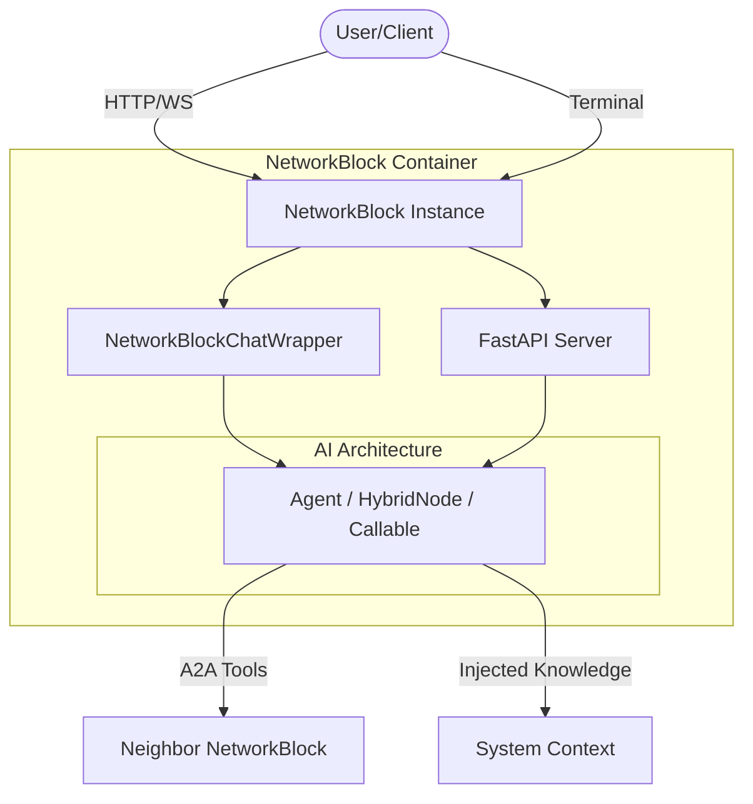

# 📦 Containerization with Blocks

The `NetworkBlock` container is a high-level abstraction in the Decentralized AI Ecosystem (DAIE) designed to simplify the deployment and networking of AI architectures. Think of a `NetworkBlock` as a lightweight **Docker container** but for AI logic—it handles networking, streaming, logging, and environmental awareness so your agents don't have to.

---

## 🏗️ Architecture Overview

The `NetworkBlock` sits between the AI Architecture (Agents/Nodes) and the Network/Terminal interface.




### Key Responsibilities:
1.  **Interface Wrapping**: Provides a unified `.run()` method that starts either a server or a terminal loop.
2.  **Knowledge Injection**: Automatically updates the AI's "consciousness" with its network location and neighbors.
3.  **Tool Auto-Equipping**: Equips agents with communication tools based on the defined topology.
4.  **Lifecycle Management**: Handles clean startup and shutdown of the underlying architecture.

---

## 🌟 Use Cases

### 🛠️ Local Development (Prototyping)
When building a new agent, you want to talk to it directly. By setting `chat=True`, the network_block turns your terminal into a professional chat interface with streaming tokens.

### 🌐 Distributed Mesh (Production)
In a real-world decentralized system, you might have one network_block running on a Raspberry Pi (sensor agent) and another on a GPU server (orchestrator). You connect them by simply listing their URLs in the `edges` parameter.

### 🧩 Hybrid "Mainframe" Deployment
Wrap a `HybridOrchestratorNode` in a network_block to create a powerful network hub that manages multiple internal agents while exposing a single clean API endpoint to the rest of the mesh.

---

## 🚀 Usage Examples

### 1. Simple Networked Agent
Run an agent as a background server that others can talk to.

```python
from daie import Agent, AgentConfig
from daie.container import NetworkBlock

# Define the agent
agent = Agent(config=AgentConfig(name="Assistant"))

# Wrap in a NetworkBlock
network_block = NetworkBlock(
    architecture=agent,
    host="0.0.0.0",
    port=8000,
    chat=False,     # Disable terminal, enable server
    logs=True       # Keep logs on since there is no terminal UI
)

network_block.run()
```

### 2. Multi-Agent Mesh with Topology
Creating a 2-node system where agents are aware of each other.

```python
# Node 1: The Researcher (listening on 8000)
researcher_block = NetworkBlock(
    architecture=researcher_agent,
    port=8000,
    edges=["http://localhost:8001"] # Connected to Writer
)

# Node 2: The Writer (listening on 8001)
writer_block = NetworkBlock(
    architecture=writer_agent,
    port=8001,
    edges=["http://localhost:8000"] # Connected back to Researcher
)
```

---

## 🧠 Conscious Awareness & A2A Tools

One of the most powerful features of the `NetworkBlock` is that it **teaches** the AI about the network.

### The System Context Injection
When a network_block starts, it appends a hidden context to the agent's system prompt:
> **[System Knowledge]**
> You are running at http://0.0.0.0:8001. 
> You have a direct connection to: http://localhost:8000.
> You have 'a2a_send_message' and 'a2a_delegate_task' tools available.

### Autonomous Task Delegation
Because the agent "knows" its neighbors and has the tools, it can reason like this:
1.  **User Task**: "Write a report on AI trends."
2.  **Agent Reasoning**: *"I am a Writer, but I have a neighbor at 8000 who is a Researcher. I will use 'a2a_delegate_task' to ask them for data first."*
3.  **Result**: The agents collaborate across the network without any manual piping by the developer.

---

## ⚙️ Configuration Reference

| Parameter | Type | Default | Description |
|-----------|------|---------|-------------|
| `architecture` | `Any` | **Required** | The AI logic (Agent, HybridNode, or callable). |
| `host` | `str` | `"0.0.0.0"` | Server bind address. |
| `port` | `int` | `8000` | Network port. |
| `chat` | `bool` | `False` | Enable interactive terminal mode. |
| `edges` | `List[str]` | `[]` | List of neighbor URLs/ports (defines topology). |
| `stream` | `bool` | `True` | Enable real-time token streaming in chat mode. |
| `logs` | `bool` | `None` | Toggle logs (Auto-disabled if `chat=True`). |

---

## 🧪 Testing & Verification
You can verify your network_block configurations using `pytest`. The system ensures that:
- `chat=True` correctly suppresses noise logs.
- `edges` are correctly injected into the agent's internal network pool.
- `A2A tools` are added only when valid network edges exist.

Check `tests/test_container.py` for full technical validation patterns.

---

## 🌍 Real-World Applications

The `NetworkBlock` system is designed for high-stakes, distributed AI environments. Here are a few patterns you can implement:

### 1. The "Global Research Lab"
- **Node A (London)**: A NetworkBlock wrapping an Orchestrator with `Researcher` agents.
- **Node B (Tokyo)**: A NetworkBlock wrapping a `Writer` agent.
- **Workflow**: The London node researches a topic and uses `a2a_delegate_task` to send the raw data to Tokyo. The Tokyo node writes the final PDF and sends it back.
- **Benefit**: Geographical distribution of tasks and resource sharing across time zones.

### 2. Autonomous "Smart DevOps" Mesh
- **Edge Nodes**: Blocks running on individual app servers, monitoring logs via `FileManagerTool`.
- **Central Brain**: A NetworkBlock wrapping a `Coordinator` agent.
- **Workflow**: Edge nodes detect an error and proactively send an `a2a_message` to the Central Brain. The Brain analyzes the logs and delegates a fix-task back to the specific edge node.
- **Benefit**: Fully decentralized self-healing infrastructure.

### 3. Hierarchical Customer Support
- **Frontend NetworkBlock**: An agent with a friendly persona running in `chat=True` for human interaction.
- **Backend Expert Blocks**: Specialized blocks for Billing, Technical Support, and Legal.
- **Workflow**: The Frontend agent identifies the user's problem and delegates the complex technical part to the Backend Expert network_block using A2A tools.
- **Benefit**: Keeps the user-facing agent fast and focused while leveraging deep expertise from specialized nodes.

### 4. IoT Sensor Fusion
- **Sensor Blocks**: Lightweight agents running on edge devices (Raspberry Pi/Jetson).
- **Fusion NetworkBlock**: A high-power server network_block with a vision model.
- **Workflow**: Sensor blocks send periodic status updates. When a sensor detects motion, it delegates an "Analyze Image" task to the Fusion NetworkBlock, which has the GPU power to run complex vision models.
- **Benefit**: Optimizes GPU usage by centralizing heavy compute while keeping detection logic at the edge.

---

## ⚖️ Advantages & Disadvantages of NetworkBlock Containerization

| # | Feature / Aspect | ✅ Advantage | ❌ Disadvantage / Trade-off |
|---|------------------|--------------|-----------------------------|
| 1 | **Deployment Speed** | Instant "plug-and-play" deployment for any agent. | Requires port management for every instance. |
| 2 | **Networking** | Built-in A2A tool auto-equipping. | Network latency between decentralized blocks. |
| 3 | **Observability** | Smart logging (auto-suppressed in chat mode). | Distributed logs can be harder to aggregate. |
| 4 | **Developer UX** | Professional interactive terminal out of the box. | Terminal mode prevents background server tasks. |
| 5 | **Encapsulation** | Complete isolation of AI logic from network code. | Increases the complexity of the object hierarchy. |
| 6 | **Scalability** | Easy to spin up 100s of micro-agent nodes. | High memory overhead if over-provisioning blocks. |
| 7 | **Topology** | Native support for graph-based `edges`. | Manual configuration of URLs can be error-prone. |
| 8 | **Consciousness** | Agents gain "self-awareness" of their network role. | Injected prompts add to the token context size. |
| 9 | **Protocol Support** | Unified HTTP/WS and terminal interfaces. | No native support for GRPC or NATS yet. |
| 10 | **Security** | Inherited auth and whitelist protection. | Each network_block is a separate network attack surface. |
| 11 | **Flexibility** | Can wrap agents, nodes, or even simple functions. | Generic wrapper might miss specialized optimization. |
| 12 | **Streaming** | Native real-time token streaming in terminal. | Streaming over slow networks can be choppy. |
| 13 | **Lifecycle** | Graceful startup/shutdown handling. | Improper shutdown can leave ports "zombie" locked. |
| 14 | **Resource Management** | Fine-grained control over individual network_block ports. | No global resource orchestrator (requires L4). |
| 15 | **Tooling** | Automatic setup of communication managers. | Duplicate managers if many blocks run in one script. |
| 16 | **Maintenance** | Update network topology without touching AI code. | Updating 100 blocks requires automated scripting. |
| 17 | **Learning Curve** | Extremely low (one `NetworkBlock.run()` call). | Understanding internal injection requires docs. |
| 18 | **Interoperability** | Standard FastAPI endpoints for external apps. | External apps must follow the A2A protocol format. |
| 19 | **Reliability** | Isolated crashes don't bring down the whole mesh. | Failure of one "critical" network_block can stall a chain. |
| 20 | **Innovation** | Enables "Living Tapestry" multi-node AI. | Complexity of debugging "who-talked-to-who". |

---

## 🔐 Security & Authentication

The `NetworkBlock` container inherits the security model of the underlying DAIE communication layer.

- **Auth Tokens**: If you set an `auth_token` in your `AgentConfig`, the NetworkBlock's server will require this token in the WebSocket headers for any incoming A2A messages.
- **Whitelist**: Use `allowed_senders` in the agent config to restrict which Agent IDs are allowed to communicate with the network_block.
- **TLS/SSL**: For production, it is recommended to run Blocks behind a reverse proxy (like Nginx) to handle HTTPS/WSS encryption.

---

## 💡 Best Practices

1.  **Port Management**: Always use unique ports when running multiple blocks on the same machine. Common practice is to start at `8000` and increment.
2.  **Logging**: When running in `chat=False` mode, set `logs=True` to see incoming network requests and tool execution in your server console.
3.  **Graceful Shutdown**: Always use `network_block.run()` inside a `try/finally` network_block or a `main()` function to ensure that background threads and LLM connections are closed properly.
4.  **Edge Redundancy**: If a neighbor node changes its IP, you only need to update the `edges` list in the NetworkBlock—no changes are needed to the internal AI logic.

---

## ⚖️ Comparison: NetworkBlock vs. Node vs. Orchestrator

| Component | Level | Focus | Primary Interface |
|-----------|-------|-------|-------------------|
| **Agent** | L1 | Cognition | Python API |
| **Orchestrator**| L2 | Workflow | Multi-Agent Delegation |
| **Node** | L3 | Infrastructure | Resource Management |
| **NetworkBlock** | **L3+** | **Deployment** | **Network (API) / Terminal** |

**Use a NetworkBlock when:** You are ready to move from a Python script to a running service or a standalone interactive tool.

---

## 🛠️ Troubleshooting

### Common Issues:

- **"Port already in use"**: Another network_block or process is listening on your chosen port. Change the `port` parameter.
- **"Chat Loop not appearing"**: Ensure you have called `network_block.run()` and that `chat=True`. Check if your terminal supports ANSI streaming.
- **"Edges not connecting"**: Verify the URL format (must include `http://` or `ws://`). Ensure the neighbor network_block is actually running and reachable over your network.
- **"A2A Tool Missing"**: Tools are only auto-added if `edges` is not empty. If you add edges *after* initialization, call `network_block._equip_communication_tools()` manually.
